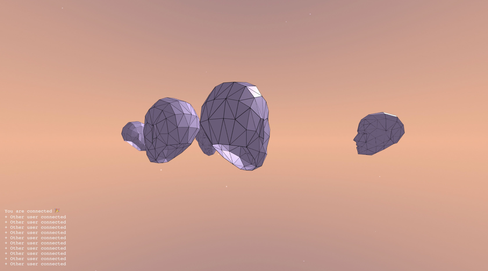

# Quarantine Hub

**Quarantine Hub is a communal space for abstract interaction. It explores if anonymity and closeness can exist concurrently.**

*This app isn’t supported on some browsers. Please be sure to use up–to–date versions of Chrome or Firefox on desktop to get the full experience.*

Uses [networked-aframe](https://www.npmjs.com/package/networked-aframe), a framework that adds webrtc and socketio support to aframe. The model is an adapted version of [this royalty free asset](https://www.turbosquid.com/3d-models/faces-mesh-obj-free/830879).

The log is located [here](./log.md)



## Client

Deployed on Vercel

https://quarantine-hub.now.sh/

## Server

Running on Heroku (free plan hence the server needs some time to fire up after a longer period of inactivity)

```
SERVER URL ws://quarantinehub-server.herokuapp.com:8080
```
